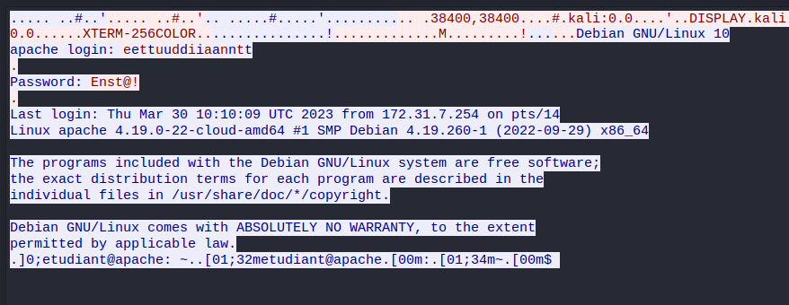
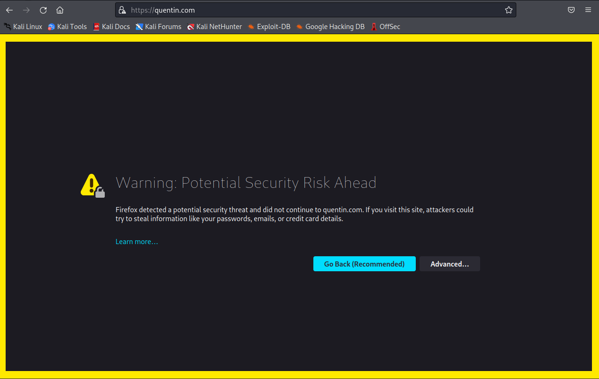

# TP3 - Cryptographie
Leonardo Picoli - 06/04/2023

## **Introduction**
Ce TP propose d’étudier deux jeux de protocoles applicatifs permettant de sécuriser ou
non la communication.
Le premier jeu fait appel aux applications Telnet et SSH permettant d’administrer un
serveur à distance. Cette première partie vous propose d’abord d’étudier en quoi le protocole Telnet est vulnérable à partir de l’accès au serveur d’adresse IP 172.31.7.123 joignable à
partir du tunnel VPN 1
. Il est ensuite demande de configurer un serveur SSH sur votre Kali
de manière à obtenir une solution sécurisée pour le même serveur VPN.
Le second jeu fait appel à la configuration d’un serveur Web à partir d’Apache. Comme
précédemment, il est proposé d’étudier l’authentification HTTP Basic et de retrouver les
authentifiants en clair. La sécurisation du trafic est obtenue cette fois à partir de certificats
et de l’implémentation d’une couche TLS protégeant HTTP

## **1. Observation du trafic lors d’une connexion Telnet**

Après avoir monté votre tunnel VPN (`sudo openvpn cours.ovpn`), et s'être connecté sur le serveur d’adresse `IP 172.31.7.251` à partir de l’outil Telnet (authentifiants student ↔ Enst@!), on a utilisé wireshark pour observer le trafic.

Après avoir fait `telnet 172.31.7.251 23` et avoir suivi la **TCP Stream** dans Wireshark, on peut voir le résultat suivant:



On peut voir que la mot de passe et l'username sont complètement visibles. Alors, on peut constater que il n'y a pas de cryptographie pour telnet! 

En plus, on peut voir qu'à chaque fois qu'on tape sur le clavier pour entrer l'username, 2 réquisitions TELNET sont faites, et un réquisition TCP (ACK) est faite. Comme montre le tableau ci-dessous:

| Source | Destination | Protocol | Info |
| ------ | ----------- | -------- | ---- |
| 10.8.0.2 | 172.31.7.251 | TELNET | Telnet Data ... |
| 172.31.7.251 | 10.8.0.2 | TELNET | Telnet Data ... |
| 10.8.0.2 | 172.31.7.251 | TCP | 52658 -> 23 [**ACK**] |

Dans le cas du mot de passe, il n'y a pas la réquisition TELNET de 172.31.7.251 pour 10.8.0.2, donc 2 réqusitions, 1 TELNET et 1 TCP ACK pour chaque char qu'on tape dans le clavier.

Comme ça, on peut découvrir quelle est la taille du mot de passe aussi, just en regardant les réquisitions dans Wireshark

## **2. Installation et configuration d’un serveur SSH**

### **Q 2.1 - Quel est le message affiché ? À quoi correspond-il ? Quelle est sa signification? Quel risque éventuel identifiez-vous? Quelles étapes doit-on suivre pour s’en prémunir ?**

**ATTENTION !** Pour que les réponses soient complètes (et pour faciliter la compréhension des cours à l'avenir), les références suivantes ont été utilisées : 

1. _"The secure shell - the definitive Guide 2" - Daniel J. Barrett and Richard E. Silverman_;
2. ChatGPT: https://chat.openai.com/chat/

Après avoir démarré le SSH serveur, et après avoir lancé le code pour se connecter au serveur `ssh kali@localhost`, on reçoit la message suivante:

> └─$ ssh kali@localhost       
The authenticity of host 'localhost (::1)' can't be established.  
ED25519 key fingerprint is SHA256:F6TGHH+PfaTvB9fbUN3FwfCk/Qi47Km6yhiAKH2Sm7A.  
This key is not known by any other names.  
Are you sure you want to continue connecting (yes/no/[fingerprint])? **yes**

Après avoir répondu **_yes_**, le client continue: 

> Warning: Permanently added 'localhost' (ED25519) to the list of known hosts.

Ce message n'apparaît que la première fois que vous contactez un hôte distant particulier. Il s'agit d'une fonction de sécurité liée au concept de **_known hosts_** de SSH.

Supposons qu'un adversaire veuille obtenir notre mot de passe. Il sait que nous utilisons SSH et ne peut donc pas surveiller notre connexion en écoutant le réseau (car les messages sont encryptés, differemment de telnet, par exemple). Au lieu de cela, il subvertit le **_domain naming service_** utilisé par notre hôte local de sorte que le nom de notre hôte distant prévu, ensta.com (par exemple), se traduise faussement par l'adresse IP d'un ordinateur géré par lui ! Il installe ensuite un serveur SSH modifié sur le faux hôte distant et attend. Lorsque nous nous connectons via notre fidèle client SSH, le serveur SSH modifié enregistre notre mot de passe pour que l'adversaire puisse l'utiliser ultérieurement (ou l'utiliser à mauvais escient, plus probablement). Le faux serveur peut ensuite se déconnecter avec un message d'erreur planifié à l'avance, tel que "Le système est en panne pour cause de maintenance - veuillez réessayer après 16 heures". Pire encore, il peut nous tromper complètement en utilisant notre mot de passe pour se connecter au vrai ensta.com et transmettre de manière transparente des informations entre nous et le serveur, en surveillant l'ensemble de notre session. Cette stratégie hostile est appelée **_man-in-the-middle_** attack. Si nous ne pensons pas à vérifier l'adresse IP d'origine de notre session sur le serveur, nous risquons de ne jamais nous apercevoir de la supercherie.

Le mécanisme de **_known hosts_** de SSH empêche de telles attaques. Lorsqu'un client et un serveur SSH établissent une connexion, chacun d'eux prouve son identité à l'autre. En effet, non seulement le serveur authentifie le client (en exigeant le mot de passe), mais le client authentifie également le serveur par cryptographie à clé publique. En bref, chaque serveur SSH dispose d'un identifiant secret et unique, appelé **_host key_**, qui lui permet de s'identifier auprès des clients. Lors de la première connexion à un hôte distant, une contrepartie publique de la **_host key_** est copiée et stockée dans votre compte local (en supposant que nous ayons répondu "yes" à l'invite du client concernant les clés d'hôte, plus haut). Chaque fois que vous vous reconnectez à cet hôte distant, le client SSH vérifie l'identité de l'hôte distant à l'aide de cette clé publique.

Bien entendu, il est préférable d'avoir enregistré la clé publique d'hôte du serveur avant de s'y connecter la première fois, faute de quoi vous vous exposez techniquement à une attaque de type "man-in-the-middle" lors de cette première connexion. Les administrateurs peuvent maintenir des listes d'hôtes connus à l'échelle du système pour des ensembles d'hôtes donnés, mais cela ne sert pas à grand-chose pour se connecter à de nouveaux hôtes aléatoires dans le monde entier. Tant qu'il n'existe pas de méthode fiable et largement déployée pour récupérer ces clés en toute sécurité (comme le DNS sécurisé ou une infrastructure de clés publiques basée sur X.509), ce mécanisme d'enregistrement à la première utilisation est un compromis acceptable.

### **Q 2.2 - Supprimer à présent les clefs présentent dans le répertoire de configuration de ssh, puis regénérer-les et redémarrer le service ! Quel message d’erreur voit alors votre binôme? Quel est sa signification? Quelle attaque peut alors être déjouée ?**

Les cles présentent dans le répertoire de configuration de ssh sont stockés dans le dossier **_/etc/ssh_**. Voici un exemple:

```
└─$ ls -la /etc/ssh  
total 620    
drwxr-xr-x   4 root root   4096 Mar 22 10:58 .  
drwxr-xr-x 176 root root  12288 Apr 10 07:12 ..  
-rw-r--r--   1 root root 573928 Feb  8 05:43 moduli  
-rw-r--r--   1 root root   1650 Feb  8 05:43 ssh_config  
drwxr-xr-x   2 root root   4096 Feb  8 05:43 ssh_config.d  
-rw-r--r--   1 root root   3223 Feb  8 05:43 sshd_config  
drwxr-xr-x   2 root root   4096 Feb  8 05:43 sshd_config.d  
-rw-------   1 root root    505 Mar 22 10:58 ssh_host_ecdsa_key  
-rw-r--r--   1 root root    171 Mar 22 10:58 ssh_host_ecdsa_key.pub  
-rw-------   1 root root    399 Mar 22 10:58 ssh_host_ed25519_key  
-rw-r--r--   1 root root     91 Mar 22 10:58 ssh_host_ed25519_key.pub  
-rw-------   1 root root   2590 Mar 22 10:58 ssh_host_rsa_key  
-rw-r--r--   1 root root    563 Mar 22 10:58 ssh_host_rsa_key.pub  
```

Et, d'un autre côté, les clés (et aussi le fichier _known_hosts_) des clients sont stockés dans le répertoire: **_~/.ssh/_**:
```
└─$ ls -la ~/.ssh    
total 24  
drwx------  2 kali kali 4096 Apr 10 09:54 .  
drwx------ 18 kali kali 4096 Apr 10 09:55 ..  
-rw-------  1 kali kali 2590 Apr 10 09:54 id_rsa  
-rw-r--r--  1 kali kali  563 Apr 10 09:54 id_rsa.pub  
-rw-------  1 kali kali 1706 Apr 10 09:04 known_host  
```

Alors pour renégérer les clefs, on execute (pour supprimer):

`└─$ sudo rm -v /etc/ssh/ssh_host_*`

et après (récréer):

`└─$ sudo dpkg-reconfigure openssh-server`

et on "restart" le serveur:

`└─$ sudo systemctl restart ssh`

Maintenant, on essaie de se connecter de nouveau: 

```
└─$ ssh kali@localhost        
@@@@@@@@@@@@@@@@@@@@@@@@@@@@@@@@@@@@@@@@@@@@@@@@@@@@@@@@@@@
@    WARNING: REMOTE HOST IDENTIFICATION HAS CHANGED!     @
@@@@@@@@@@@@@@@@@@@@@@@@@@@@@@@@@@@@@@@@@@@@@@@@@@@@@@@@@@@
IT IS POSSIBLE THAT SOMEONE IS DOING SOMETHING NASTY!
Someone could be eavesdropping on you right now (man-in-the-middle attack)!
It is also possible that a host key has just been changed.
The fingerprint for the ED25519 key sent by the remote host is
SHA256:2a/XCi2ethSxh+CdkIbcMIHABLBNfIh3LCcDTduRgLk.
Please contact your system administrator.
Add correct host key in /home/kali/.ssh/known_hosts to get rid of this message.
Offending ECDSA key in /home/kali/.ssh/known_hosts:7
  remove with:
  ssh-keygen -f "/home/kali/.ssh/known_hosts" -R "localhost"
Host key for localhost has changed and you have requested strict checking.
Host key verification failed.
```

Ce message signifie que l'étape d'authentification entre la machine locale et la machine distante a échoué. En d'autres termes, la "fingerprint" de la clé publique de l'hôte qui était présente dans le fichier known_hosts du client ne correspondait pas à la nouvelle fingerprint envoyée par l'hôte lorsque nous avons demandé l'ouverture de session.
Cela peut signifier que 
1. En fait, un intrus s'est introduit dans le système et a modifié les clés afin de pouvoir récupérer les mots de passe des nouveaux clients qui se connectent pour la première fois sans se douter de rien (attaque de type "man-in-the-middle") ; ou
2. Quelqu'un a légitimement modifié les clés SSH.

### **Q 2.3 - Des options en ligne de commandes permettent cependant de ne pas tenir compte de ce message d’avertissement. Quelles sont-elles? Contre quel type d’attaque ne peut-on plus alors se protéger? Quells protection continue cependant d’offrir SSH ?**

Les options en ligne de commande pour ignorer l'avertissement "REMOTE HOST IDENTIFICATION HAS CHANGED" est l'option "-o", qui peut être utilisée avec la valeur "StrictHostKeyChecking=no": `ssh -o StrictHostKeyChecking=no user@hostname`  

En utilisant cet option, l'utilisateur peut se connecter à l'hôte distant sans être averti de la modification de la clé de l'hôte. Cependant, cela signifie que l'utilisateur ne peut plus se protéger contre les attaques de type "Man In The Middle" (MITM) car l'avertissement sur la modification de la clé de l'hôte est un mécanisme de sécurité intégré de SSH pour prévenir les attaques MITM.

Malgré cela, SSH continue d'offrir des protections telles que la cryptographie asymétrique pour sécuriser les communications et la possibilité de configurer des mots de passe forts pour l'authentification. Il est donc important de continuer à utiliser SSH pour se connecter à des hôtes distants, même si la clé de l'hôte a changé, mais en s'assurant que les options de sécurité sont correctement configurées.

### **Q 2.4 - Configurer maintenant votre serveur de manière à interdire l’authentification par mot de passe et imposer l’authentification par clef. En parallèle, générer des clefs et fournisser la partie publique à votre binôme. Configurer votre serveur de manière à autoriser la sienne. Quelles sont les différentes étapes à suivre pour implémenter ce type d’authentification ?**

Le fichier pour modifier les paramètres du serveur se trouve dans **_/etc/ssh/sshd_config_**. Pour voir le contenu du fichier, par exemple `cat /etc/ssh/sshd_config`, ce qui donne:

``` 
... 

Port 22
#AddressFamily any
#ListenAddress 0.0.0.0
#ListenAddress ::

#HostKey /etc/ssh/ssh_host_rsa_key
#HostKey /etc/ssh/ssh_host_ecdsa_key
#HostKey /etc/ssh/ssh_host_ed25519_key

...

# Authentication:

#LoginGraceTime 2m
#PermitRootLogin prohibit-password
#StrictModes yes
#MaxAuthTries 6
#MaxSessions 10

#PubkeyAuthentication yes

# Expect .ssh/authorized_keys2 to be disregarded by default in future.
#AuthorizedKeysFile     .ssh/authorized_keys .ssh/authorized_keys2

#AuthorizedPrincipalsFile none

#AuthorizedKeysCommand none
#AuthorizedKeysCommandUser nobody

# For this to work you will also need host keys in /etc/ssh/ssh_known_hosts
#HostbasedAuthentication no
# Change to yes if you don't trust ~/.ssh/known_hosts for
# HostbasedAuthentication
#IgnoreUserKnownHosts no
# Don't read the user's ~/.rhosts and ~/.shosts files
#IgnoreRhosts yes

# To disable tunneled clear text passwords, change to no here!
#PasswordAuthentication yes
#PermitEmptyPasswords no

...
```

Pour interdire l'authentification par mot de passe et imposer l'authentification par clé, il est nécessaire de suivre les étapes suivantes :

1. Modifier les paramètres de configuration SSH sur le serveur pour interdire l'authentification par mot de passe et autoriser l'authentification par clé. Pour cela, éditer le fichier /etc/ssh/sshd_config et ajouter les lignes suivantes :  
    ``` yaml
    PasswordAuthentication no
    PubkeyAuthentication yes
    ```
    Il est également recommandé de désactiver la connexion SSH en tant que superutilisateur, en ajoutant la ligne suivante :
    ``` yaml
    PermitRootLogin no
    ```
2. Générer une paire de clés SSH publique/privée sur le serveur. Cela peut être fait en utilisant la commande ssh-keygen. Il est recommandé de spécifier un nom de fichier pour la clé privée pour une meilleure organisation, par exemple:  
`ssh-keygen -t ed25519 -f ~/.ssh/server_key`.  
Et aussi gérérer un clé publique du côté du binome. 

3. Ajouter la clé publique du binôme à la liste des clés autorisées sur le serveur. Pour cela, la clé publique du binôme doit être copiée dans le fichier **´~/.ssh/authorized_keys´** sur le serveur. Cela peut être fait manuellement en éditant le fichier ou en utilisant la commande **´ssh-copy-id´**.  
Par exemple: `ssh-copy-id -i ~/.ssh/binome_key.pub user@server.`

4. Redémarrer le service SSH pour que les modifications soient prises en compte. Pour cela, exécuter la commande suivante : sudo service ssh restart.

Une fois ces étapes suivies, les connexions SSH au serveur ne pourront être établies qu'avec une clé privée correspondant à une clé publique autorisée sur le serveur, et non avec un mot de passe.

### **Q 2.5 - Est-il toujours possible de mener une attaque active de man-int-the-middle ? Que se passe-t-il si l’utilisateur comme précédemment ne tient pas compte du message de sécurité?**

Il est possible de dire que les attaques de "man-in-the-middle" (MITM) ne sont plus possibles lorsqu'une authentification par clé est utilisée, à condition que l'utilisateur vérifie correctement la clé de l'hôte lors de la connexion. Si l'utilisateur ne vérifie pas correctement la clé de l'hôte lors de la connexion, l'attaquant peut usurper l'identité de l'hôte distant en utilisant sa propre paire de clés cryptographiques, ce qui permet de réaliser une attaque MITM.

L'authentification par clé repose sur l'utilisation d'une paire de clés cryptographiques, une clé privée détenue par l'utilisateur et une clé publique détenue par le serveur. Lorsque l'utilisateur se connecte au serveur, le serveur envoie un défi cryptographique que l'utilisateur doit signer avec sa clé privée pour prouver son identité. Le serveur vérifie alors la signature en utilisant la clé publique correspondante stockée sur le serveur.

Si un attaquant intercepte la communication entre l'utilisateur et le serveur et tente de se faire passer pour l'un des deux, l'authentification par clé empêchera cette attaque. En effet, l'attaquant ne dispose pas de la clé privée de l'utilisateur, et donc ne pourra pas signer le défi cryptographique envoyé par le serveur.

## **3. Installation et configuration d’un serveur Web TLS**

### **Configuration initiale binôme**

Pour installer le paquet Apache2:

```
sudo apt-get update
sudo apt-get install apache2
```

Une fois le paquet Apache2 installé, on peut récupérer sa configuration en accédant au fichier de configuration principal situé dans le répertoire `/etc/apache2/`, par exemple:

```bash
sudo vim /etc/apache2/apache2.conf
```

Pour choisir le nom du domaine, on a changé le fichier `sudo vim /etc/hosts`:

```
147.250.8.58  leo.com
147.250.8.56  quentin.com
127.0.0.1     localhost
...
```

Pour créer un fichier de mot de passe et limiter l'accès du contenu à mon binôme, on a utilisé la commande htpasswd de la manière suivante :

`sudo htpasswd -c /etc/apache2/.htpasswd quentin`

La commande nous demande de saisir et de confirmer un mot de passe pour cet utilisateur.

Une fois créé le fichier de mot de passe, on a configuré Apache2 pour utiliser ce fichier en ajoutant les directives suivantes au fichier de configuration de site virtuel :

`sudo vim /etc/apache2/sites-available/000-default.conf`

et on a ajouté les lignes suivantes, à l'interieur de la balise `<VirtualHost>`:

```bash
<Directory "/var/www/html">
    AuthType Basic
    AuthName "Restricted Content"
    AuthUserFile /etc/apache2/.htpasswd
    Require user quentin
</Directory>
```

et après on a redemarré le système Apache:

`sudo systemctl restart apache2`

Le trafic Wireshark se trouve dans le fichier [Wireshark Results](./wireshark-results.pdf).

On peut remarquer que tout le contenu du site HTML est visible, ce qui signifie que la connexion est pas chiffré. Par contre, l'accès au mot de passe est chiffré, donc on peut pas obtenir le mot de passe du binôme.


### **Configuration certificat**

Tout d'abord on a éxécuté le code pour créer un certificat:

```
openssl req -x509 \ 
-newkey rsa:4096 \ 
-keyout key.pem \ 
-out cert.pem \
-days 365
```

Après, on a éxécuté le code pour que Apache accèpte SSL:

```
sudo a2ensite default-ssl
sudo systemctl reload apache2
```

Et aussi, dans le fichier:

`sudo vim /etc/apache2/sites-available/default-ssl.conf`

On a ajouté les certificats:

```
SLEngine on
SSLCertificateFile /path/to/you.cert
SSLCertificateKeyFile /path/to/you.key
```

Après, lorsqu'on accède le site de mon binôme, le message suivant s'affiche:



Ce message afficher par le browser est commun, et peut se produire pour plusieurs raisons, notamment si le certificat est auto-signé (c'est-à-dire qu'il n'a pas été signé par une autorité de certification de confiance), comme on a fait. 

Le chiffrement est assuré en utilisant les certificats générés et configurés dans Apache.
Lorsqu'un utilisateur accède au site web, son navigateur envoie une demande de connexion sécurisée au serveur. Le serveur répond en envoyant son certificat numérique signé, qui contient la clé publique du serveur. Le navigateur vérifie que le certificat a été signé par une autorité de certification de confiance et que le nom de domaine sur le certificat correspond au nom de domaine du site auquel l'utilisateur tente d'accéder. Si la vérification réussit, le navigateur génère une clé de session aléatoire et chiffre cette clé avec la clé publique du serveur et envoie la clé de session chiffrée au serveur. Le serveur déchiffre la clé de session en utilisant sa clé privée et utilise cette clé de session pour chiffrer toutes les données qui sont échangées entre le navigateur et le serveur.

Obs: Les exercices 3 et 4 etáient au délà de ce qu'on a vu en cours et très couteause en temps, donc on a décidé de ne pas le faire. 


